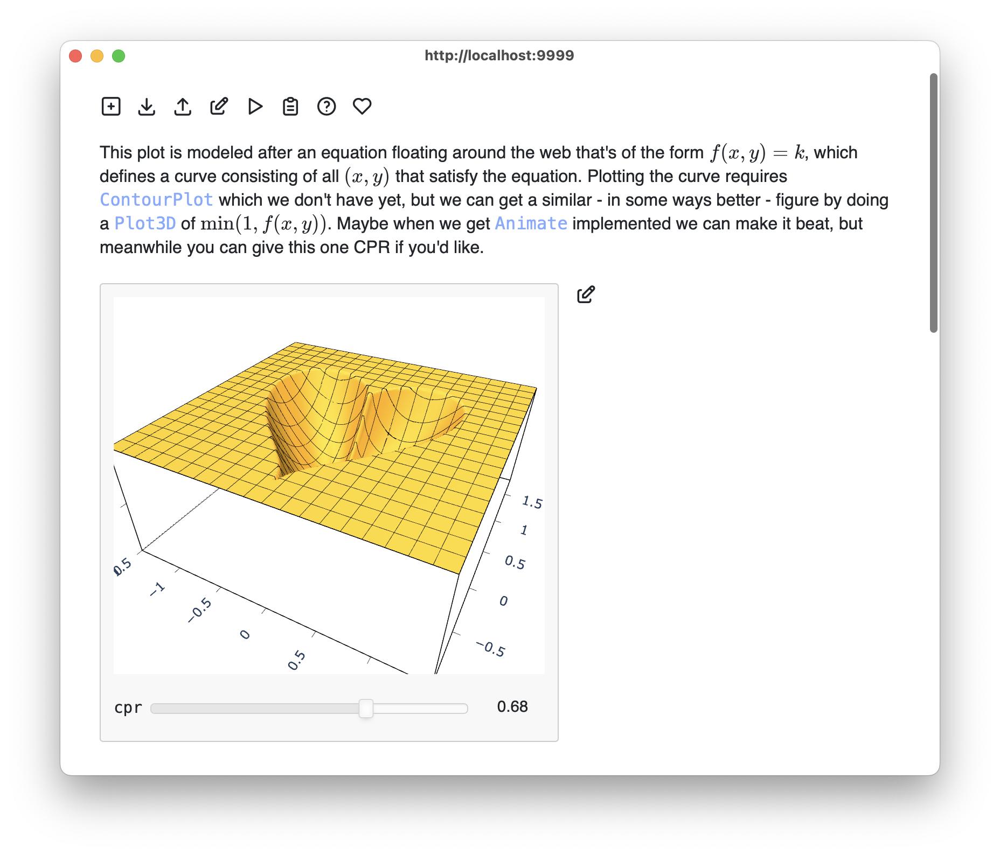

This project consists of a set of Mathics3 front-end demos, built
around Plotly and Panel, that aim to demonstrate

* how Plotly can be used for high-performance interactive graphics
rendering, enabled by the emerging vectorized graphics generation
capability of Mathics3, and

* how Panel can be used for general formatting and layout.

These technologies are interesting because they integrate well into a
number of environments:

* A work-in-progress notebook-style tool, `m3d.py`, that works with
  Markdown files with embedded Mathics3 code blocks. The Markdown is
  rendered as rich text, and the Mathics3 code blocks are evaluated
  and displayed in-place as interactive graphics. Editing the source
  Markdown and Mathics3 code is also supported.
  
  

* Panel and Plotly also work under Pyodide. A Pyodide embedding of the
  m3d.py notebook tools is in progress

* They also should support Jupyter and JupyterLite (Pyodide)
  integration (TBD)

* Integration into a command-line shell should also be possible by
  displaying graphics in a browser window.

### Markdown + Mathics3 notebook

To run locally, you will need to have a recent development version of
Mathics3 installed, and then:

    pip install -r requirements.txt
    python m3d.py data/gallery.m3d

A number of additional demo files with the extension `.m3d` (for
Mathics3 + Markdown) are available in `data/`.  You can run them from
the command line or use the file open button inside the notebook UI.

The requirements file is probably not up-to-date; let me know. Also,
if the installation of pywebview fails, the program should still run,
displaying the notebook in your system browser instead of popping up a
dedicated window.

You can also run it in your browser under Pyodide by following this
link: https://bdlucas1.github.io/mathics-m3d/. It works well enough in
a desktop browser. It also seems to work more-or-less on my iPhone but
there are currently a number of problems with fonts, tooltips, and
grabbing the sliders without moving the page.

### Demo minimal shell

    $ python shell.py
    > Manipulate[Plot3D[Sin[a x] Cos[y], {x,0,10}, {y,0,10}], {{a,1}, 0.1, 2.0, 0.1}]

This should pop up a browser window showing the plot. If it fails it might be because
the `webview` package doesn't work properly on your system, in which case try changing
the `mode` variable in `shell.py` to `webbrowser`
