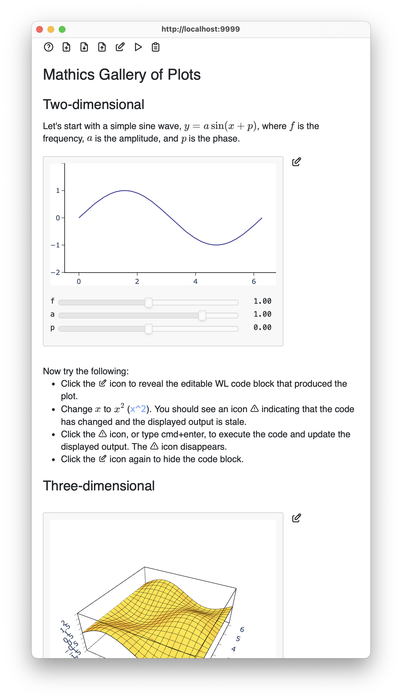

An `.m3d` file, for Mathic3 Markdown, is a Markdown file with embedded
WL triple-tick code blocks. This project aims to provide a
notebook-like experience for viewing and editing `.m3d` files: the
Markdown file is rendered as rich text, the WL code blocks are
executed, and their output is displayed in-place in the rendered
Markdown file. Facilities for editing individual code blocks, editing
the whole Markdown file, and saving and opening such files are
provided or are planned.

To run locally, you will need to have a recent development version of
Mathic3 installed, and then:

    pip install -r requirements.txt
    python m3d.py data/gallery.m3d

The requirements file is probably not up-to-date; let me know. Also,
if the installation of pywebview fails, the program should still run,
displaying the result in your system browser instead of popping up a
dedicated window.

You can also run it in your browser under Pyodide by following this
link: https://bdlucas1.github.io/mathics-m3d/. It works well enough in
a desktop browser. It also seems to work more-or-less on my iPhone but
there are currently a number of problems with fonts, tooltips, and
grabbing the sliders without moving the page.

